## Common Tools

### Map Renderer <br />
The map renderer is one of the most used tools bar the editor themselves. Written originally by zzattack, Starkku, Metadorius, E1 Elite and numerous other contributors, the tool can render individual and batch-scale maps to genered high quality previews and thumbnails for the CnCNet Client. Also contains other features such as height maps, position markers, debug features, and options to configure it to read from mods, which makes it ideal for most users.

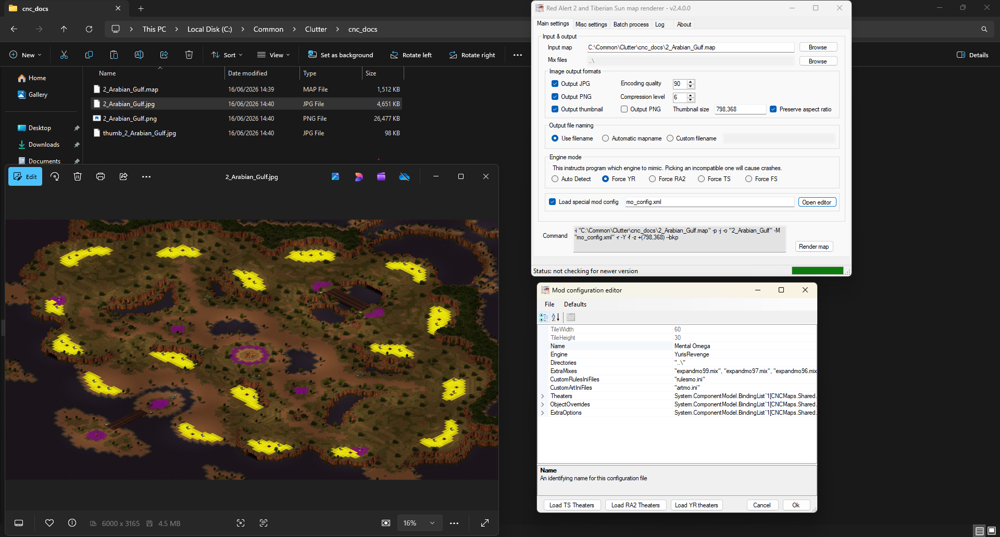
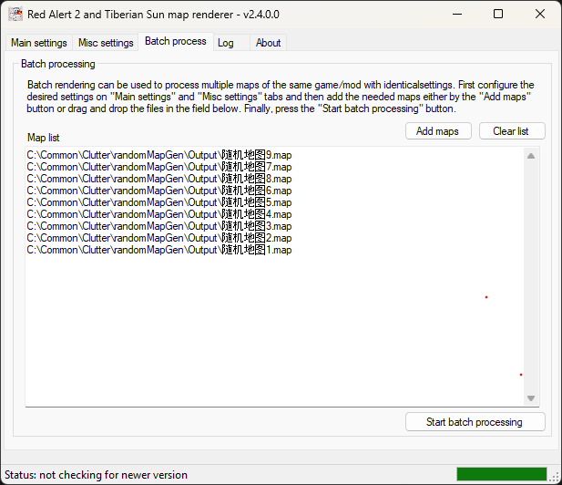
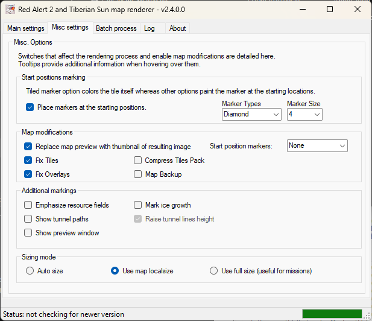

| Topic | Source + Link |
| ------------ | ------------- |
| Forum Thread | [PPM - Forum & Download](https://ppmforums.com/topic-29554-page-5/cnc-maps-renderer-rewritten-works-for-tiberian-sun-and-ra2/?postorder=asc) |
| Source Code| [Github - Original Source](https://github.com/zzattack/ccmaps-net) |


### Trigger Analyser - Web Version <br />

A tool written injavascript (by Whensons) to analyse and map out triggers in a graph. This shows the connections, links and flow of mission scripts, making it very useful in spotting issues within your triggers. 
Although it is hosted on GitHub you can download the page and use it offline. Simply open the webpage and open the map in the window to use.

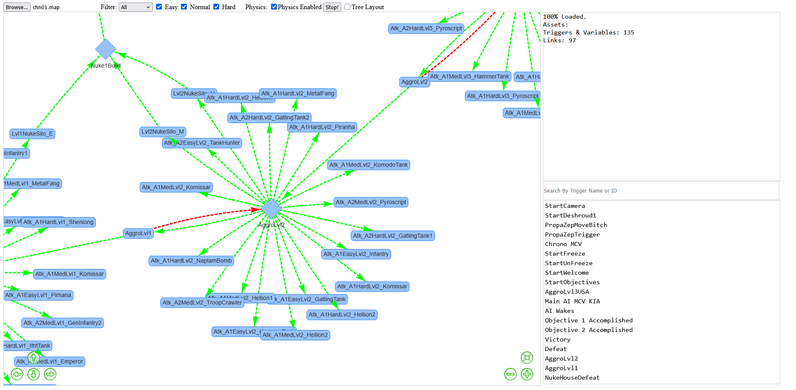

| Topic | Source + Link |
| ------------ | ------------- |
| Self-documentation | [Github - Main Page](https://github.com/whensonZWS/Trigger-Analyzer) |
| Hosted Tool | [Github Pages](https://whensonzws.github.io/Trigger-Analyzer/) |

Since the source code is available and the tool was built for MO 3.3.5, it is missing the latest scripting options available through the ares and phobos engine extensions. Resar forked the project and has updated the tool to include these, as well as varius UI improvements.

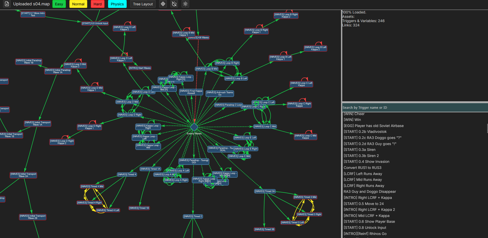
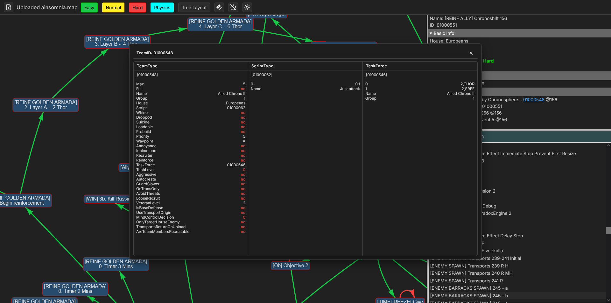

| Topic | Source + Link |
| ------------ | ------------- |
| Self-documentation | [Github - Fork](https://github.com/Resarium/Resarium.github.io) |
| Hosted Tool | [Github Pages](https://resarium.github.io/Trigger-Analyzer/) |


### Map Conversion Tool <br />
Description: A tool by Starkku which can convert the theatre, tiles, rules and overlay of maps based off user-configurable scripts. Essential if you wish to change the theatre of a map.  <br />

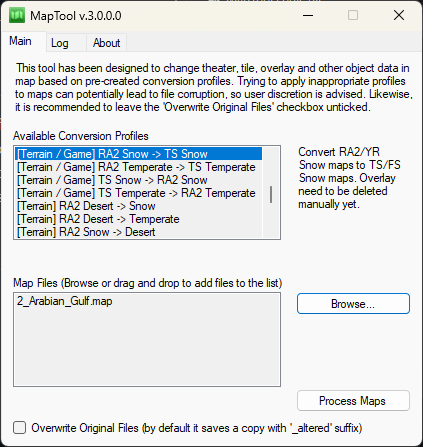
Before:
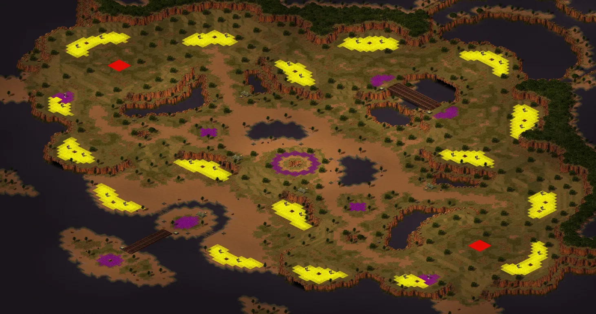
To Snow:

To TS Temperate (without any edits, will require a quick ore conversion to fix gems --> blue tib, and a few manual touchups where transitions simply cannot match):


The tool can also be used for simpler functions such as swapping ore and gems, properly swapping overlays from gems to blue tiberium and compressing the map down to reduce file size. Users can also write custom scripts to add support for terrain expansions, such swapping entirely custom terain between mods, or including custom buildings in a script if required. 

| Topic | Source + Link |
| ------------ | ------------- |
| General Information | [Github - Main Page](https://github.com/Starkku/MapTool) |
| Preset Writing Documentation | [Github - Documentation](https://github.com/Starkku/MapTool/blob/master/Conversion-Profile-Documentation.md) |
| Preset Download | [Github - Releases](https://github.com/Starkku/MapTool/releases/) |
| Forum Thread | [PPM - Forum](https://ppmforums.com/topic-43411/) |

## Less Common Tools

### Tunnel Drawer <br />
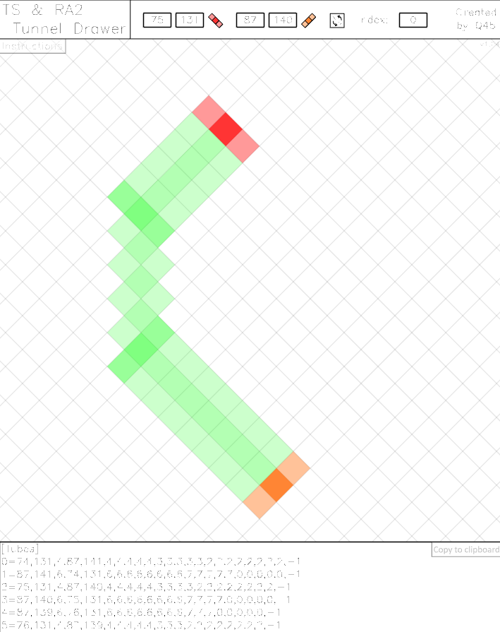

Before any of the FA2/FS editors had their tunnel support fixed, Q45 made a tunnel drawer in a flash player. This can be used to create custom tunnels far more complex than the traditional editors allower, including moderately windier paths. You need to enter the tunnel locations in yourself, and then copy the tunnel information over into the map yourself. To run this you either need to find a local flash player, which is unsupported, or use a tool such as [Ruffle](https://ruffle.rs/) (an open source flash emulator) to run this in your browser. 


| Topic | Source + Link |
| ------------ | ------------- |
| Forum Thread | [PPM - Forum](https://ppmforums.com/topic37881/tsra2tunneldrawer/) |
| Flash Player | [Adobe](https://www.adobe.com/support/flashplayer/debug_downloads.html) |

### Wavemaker <br />
A brilliant tool by PTapioK which streamlines the production of mission and survival maps, using a highly accessible GUI ideal for making wave-based attacks for scenarios such as tower defence maps. It allows manipulation of Triggers, Scripts, Taskforces, Teams and Variables on both a single and batch scale through an easy-to-see user interface.
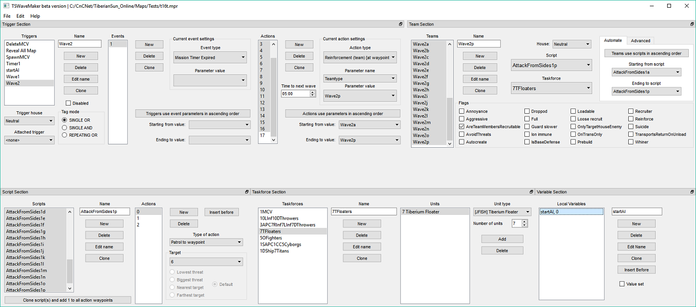

| Topic | Source + Link |
| ------------ | ------------- |
| Forum Thread | [PPM - Forum](https://ppmforums.com/viewtopic.php?t=40202&start=0&postdays=0&postorder=asc&highlight=&sid=4e24b30fb8ab401c146e831491db9400) |
| Source Code| [Github - Main Page](https://github.com/PTapioK/TSWaveMaker) |

### Map Resize Tool <br />
A tool by E1 Elite to resize maps. Unlike the standard unmodified map editor, this moves everything, including tunnels and smudges. This tool is increasing redundant as most editors do this by default now.


| Topic | Source + Link |
| ------------ | ------------- |
| Forum Thread | [PPM - Forum](https://ppmforums.com/topic-55391/mapresize/) |
| Source Code| [Github - Main Page](https://github.com/E1Elite/MapResize) |

### MISTEST Map Checker <br />


GE's Mission tester is a series of TLC Runtime scripts to check for errors and possible warnings within a map. 

| Topic | Source + Link |
| ------------ | ------------- |
| Forum Thread | [PPM - Forum](https://www.ppmforums.com/topic-68090/) |

## Special Tools

###  Trigger Analyser - Python <br />

A script by FrozenFrog to generate a trigger map graphically on the TS/RA2 Engine. Runs locally on your PC using python, check the GitHub for instructions. Listed as a special due to the ease of access that the web analyzer provides over this tool, as well as the [reason for the tool](https://tieba.baidu.com/p/6514199866?pn=1&svcp_stk=1_9r4FOR-PrSxSv03VNLvjUF3xQZAjAwwzFKZT9b4WvKoSc3tvSi1UEvZvDHgjwCjx4-xKAwzC9_--w12C6nwHpfkAfEWSzzWK9GCcWDY4z8lfJZ2IFhc4m9kSQ9NW1E7dii2Zf6v8W2-YC1ShlMEClnQ44r3_4qgxgHeo2Fh3C8gwHa1cLOGZijDCtYTo5bLZ). 


| Topic | Source + Link |
| ------------ | ------------- |
| Self-documentation | [Github - Main Page](https://github.com/FrozenFog/Ra2-Map-TriggerNetwork) |

### Trigger Index Parameter Tool <br />
A lesser known tool by Starkku used for converting the trigger house indexes in missions, important after any house changes. 

| Topic | Source + Link |
| ------------ | ------------- |
| Source Code | [Github - Main Page](https://github.com/Starkku/TriggerIndexParamTool) |

### Map Tool <br />
A command line tool by vananasun to manipulate maps

| Topic | Source + Link |
| ------------ | ------------- |
| Source Code | [Github - Main Page](https://github.com/vananasun/yr-maptool) |


### Relert js-browser
Description: A JavaScript lib developed by Heli, it provides interfaces for jaavscript for writing scripts to process the map. It's also much faster than FinalAlert2's ToolScript. Note that the README is in chinese, so you may require a translator and an understanding of the purpose.

| Topic | Source + Link |
| ------------ | ------------- |
| Source Code| [Github](https://github.com/Heli-Lab/relert.js-browser) |


## Random Map Generation

### Using Vinifera [TS]


Vinifera is an open source project providing features and bugfixes to Tiberian Sun. One of the features it restores is the option to save the loaded-in map as a .map file inside your game's directory, meaning you can use the game's random map generation and keep the map.

Firstly you need to install Vinifera, which has instructions located on their [own documentation](https://vinifera.readthedocs.io/en/develop/#with-freeware-ts). Make sure you also install a renderer, particularly [CnC-DDraw](https://github.com/FunkyFr3sh/cnc-ddraw) and [DDrawCompat](https://github.com/narzoul/DDrawCompat). Check the [renderers page on this website](/docs/rendererresources.md) for more details. Once you have set it up, open command prompt to the location of your install, and run the command:
``` LaunchVinifera.exe -DEVELOPER ``` to launch the game. This will allow you to use developer commands. You can select No to the debug console popup.

Once inside, head to Options --> Keyboard --> Developer --> Scroll down to Scenario Snapshot and assign it a hotkey. In this example, I chose / .

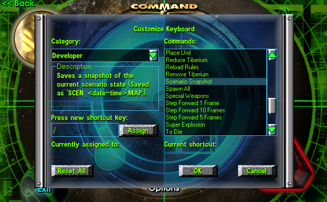

Open up Skirmish, then select Multiplay Map, Create Random Map and then you can configure the map how you wish. 

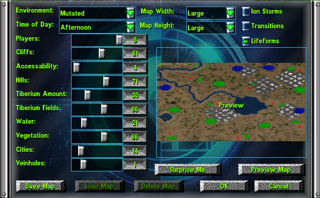

I advise setting the game to have No AI Players and a minimal unit count. 

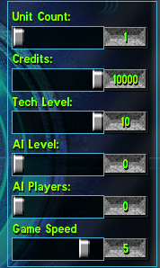

Once ingame, hit the hotkey you chose, and then a new file should be made in the root of your Vinifera folder. 
Load this up in an editor of your choice (in this case [WAE](/docs/modern_editors.md)), or use the map renderer to get a better preview.


I am of course assuming you then intend on playing through a distribution such as Tiberian Sun Client [[TSC]](https://www.moddb.com/mods/tiberian-sun-client) , or a mod's cncnet client such as [Fading Dusk](https://www.moddb.com/mods/fading-dusk) which is used in the screenshot below. To make the map ready, you need to make sure you delete the basenode that is under any placed construction yards, and i'd also delete the entire ```[Basic]``` section of each map through a text editor, so when you open it in the editor no ingame settings are carried over. You may need to add ```GameMode=Custom Map``` so that it appears inside your client. 

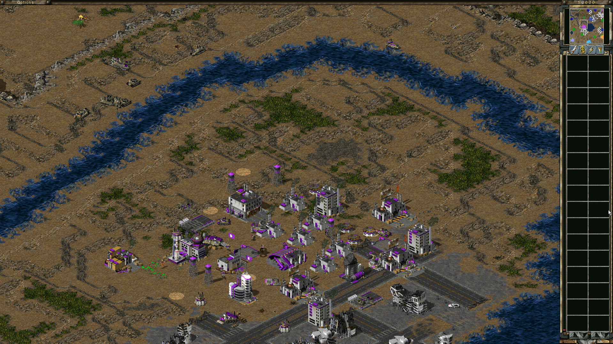

### Handama's Random Map Generator [RA2]

This is a largely customisable map generator, capable of making highly detailed random maps, as well as automating a render of these maps to be produced in batch. To run, please check the [instructions](https://github.com/handama/RandomMapGenerator_RA2) and download a build from [GitHub](https://github.com/handama/RandomMapGenerator_RA2/releases). As of writing this page, four environments have been configured. I have included a HD Render of each map, as well as a download if you wish to check it yourself. More examples exist on the GitHub. 

[Temperate [Map Download]](Assets/TEMMAP9.map)

[Desert [Map Download]](Assets/DESMAP6.map)

[Urban [Map Download]](Assets/RMGMAP6.map)

[Temperate Islands [Map Download]](Assets/ISLMAP2.map)


### PTapioK's TS Map Generator (Incomplete)

A Work-In-Progress map generator for Tiberian Sun. Can be downloaded on [GitLab](https://gitlab.com/tsmapgenerator/tsmapgenerator)

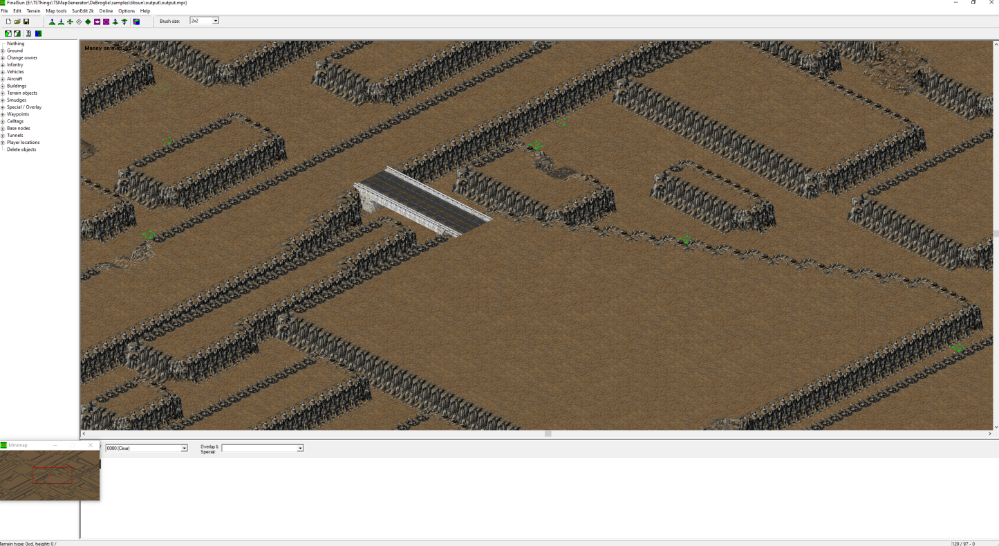
