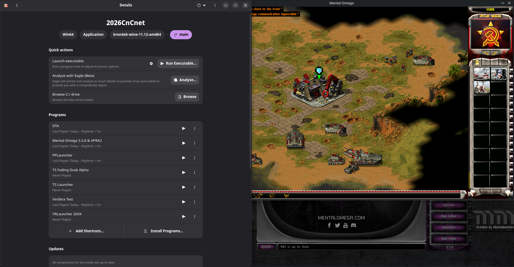
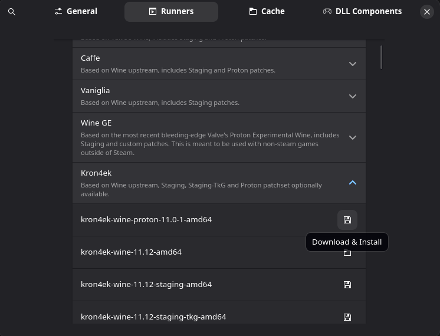
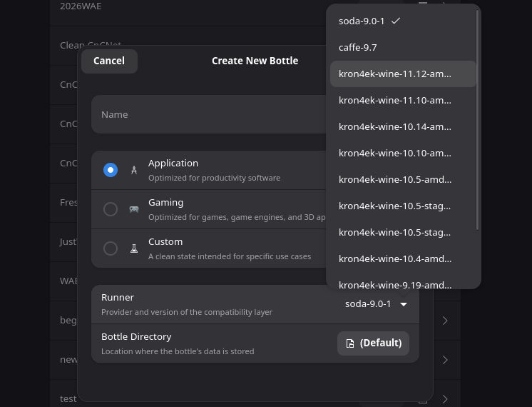
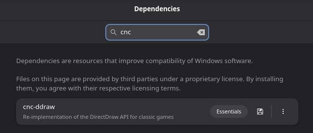

[Bottles](https://usebottles.com) is a popular GUI Manager to run Windows software on Linux through wine. Follow their website for install instructions and further details on the software itself. Setting up Bottles is possibly the quickest and easiest way to run Tiberian Sun, Yuri's Revenge and mods, and is my method of choice. 

Rather than being limited to the mainstream wine distribution that your package manager provides, bottles gives you easy access to most popular runners, including cutting edge builds and enhanced versions such as Valve's Proton that is used in steam. While the initial install only ships with Soda (at the time of writing), I personally find the latest version of Kron4ek works best, as well as being frequently updated with Wine's improvements, such as improved running under Wayland. At the time of writing the latest version of [Soda](https://usebottles.com/runners) is 9.0.1, which is a fair bit behind Kron4ek's version of 11.12. I have also had good experiences with Caffe working on all fronts, and so i recommend giving that a try. If you are not sure, you can skip this step and use Soda for now, which may work fine for you. To access this page, click the three lines at the top-right hand corner, preferences, and then Runners. You can also use the hotkey 'Ctrl + ,'.

## Setting up the bottle

To make a new bottle, click the + symbol in the top-left corner. Name it appropriately, selecting a new runner if you downloaded one. If not then you can proceed with Soda. Using either the Application or Gaming preset both work fine, I tend to use Application as i don't require all the runtimes that Gaming downloades for 3D rendering. Not always required, but i do recommend installing the CnC-DDraw dependency, which guarantees your game will run at a decent speed as well as fixing artifacts as it would on Windows. 

Below I have included the configuration that I use for Bottles so that you can produce the bottle in steps following the GUI. You should complete the main initial steps and then follow either Config 1 or Config 2 (Recommended).  There are also runner options included in a table a little further down. 
If you would prefer, I now include a bottles configuration .yml that you can [download](Assets/CnCNet_Bottles_Config.yml) and then import back into bottlesas a configuration.

### Setting up your bottle

Create new --> *Application*  
In Settings:  
- Runner: Check Runner Compatability Table  
- DXVK/VKD3D : Enabled  
- LatencyFleX : Disabled (Unless you want it) 
- Windows Version: Windows 10  

*Installed Dependencies:* 
- arial32/times32/courie32 [By Default] 
- Mono (Wine Mono) [Install Yourself if it is not there by default] 
- CnC-DDraw as a dependency [Install Yourself] 

After following all of the steps above, enter your bottle, click "Run Excutable", and guide it to your client folder and select the main client (e.g. `YRLauncher.exe` or `MentalOmegaClient,exe`), and your client should load. In caseswhere this does not work, go into the Resources foler and then try "clientogl.exe", and the client should run fine, as well as the game. In some cases the xna client also seems to work, but try the ogl and dx builds first.

### Runner Compatability
| Recommended | Runner | Client Compatability | Offline Compatability | Online Compatability | Notes |
| ------------ | ------------ | ------------- | ------------- | ------------- | ------------- |
| &#x2611; | Soda-7.0.9 | Fully Functional | Functional | Functional | Pressing esc --> Game Controls instantly closes gamemd |
| &#x2612; | Soda-8.0.2 | Fully Functional | Launches Incorrectly  | Unaccessible - launch Issue|  |
| &#x2612; | Vanigilla-8.6 | Not Functional | Unnaccesible  | Unaccessible | Error upon launching the client |
| &#x2611; | Lutris-7.2 | Fully Functional | Functional | Fails to connect to gamesurge - Error Denied | Port/ICMP Issue? |
| &#x2611; | wine-ge-proton8-25 | Fully Functional | Launches Incorrectly | Unaccessible - Launch Issue | Pressing esc --> Game Controls instantly closes gamemd |
| &#x2611; | Sys-Wine-9.1 (From package Manager) | Fully Functional | Syringe Issue | Unaccessible - Syringe Issue | Pressing esc --> Game Controls instantly closes gamemd |
| &#x2611; | Caffe-8.21 | Fully Functional | Fully Functional | Fully Functional | |
| &#x2611; | kron4ek-wine-8.20-amd64 | Fully Functional | Fully Functional | Fully Functional | |

This table has been tested using the Bottles Config 2 specifically on MO 3.3.6, with fully functional runners also tested on other mods. This was only tested with DXVK/VKD3D disabled due to physical limitations at the time.
You will need to install most of these runners from inside bottles, through the 'Main Menu' button in the top-right corner, 'Preferences', and then from the 'Runners' tab.

Note the above runners were tested on the arch-specific [aur](https://wiki.archlinux.org/title/Bottles). I recently changed from this version due to minor bugs/limitations compared to the Flatpak version, and so runners on the next table may give a more reliable list. DXVK/DXD3D/DXVK NVAPI are in use. The ogl support seems to be better on flatpak, so i can now launch the main client esxe (e.g. `MentalOmegaClient.exe` rather than having to go into resources), and i have moved to using the ogl renderer instead of the dx/gdi one.

| Recommended | Runner | Client Compatability | Offline Compatability | Online Compatability | Notes |
| ------------ | ------------ | ------------- | ------------- | ------------- | ------------- |
| &#x2611; | Caffe-9-7 | Fully Functional | Fully Functional | Fully Functional | |
| &#x2611; | kron4ek-wine-9.11-amd64 | Fully Functional | Fully Functional | Fully Functional | Up to date renderer |
