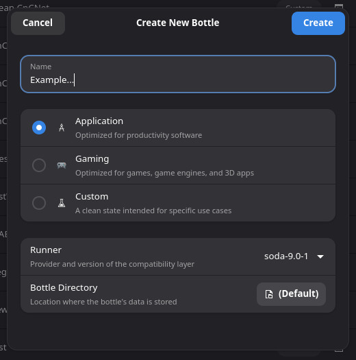
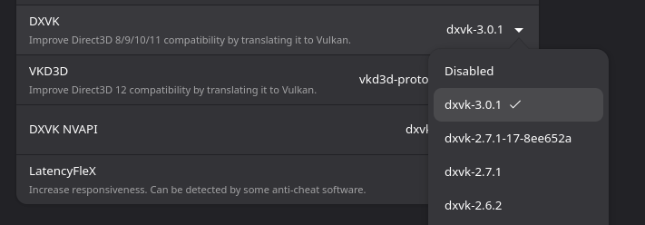

[Bottles](https://usebottles.com) is a popular GUI Manager to run Windows software on Linux through wine. Follow their website for install instructions and further details on the software itself. Setting up Bottles is possibly the quickest and easiest way to run Tiberian Sun, Yuri's Revenge and mods, and is my method of choice. 

## Setting up the bottle

To make a new bottle, click the `+` symbol in the top-left corner. Name it appropriately, selecting a new runner if you downloaded one. If not then you can proceed with Soda. Using either the Application or Gaming preset both work fine, I tend to use Application as i don't require all the runtimes that the Gaming profile downloads for 3D rendering. 

Not always required, but i do recommend installing the `CnC-DDraw dependency`, which guarantees your game will run at a decent speed as well as fixing artifacts as it would on Windows,

## Running the game

To start a CnCNet Client, simply select Launch Executable, then guide your distro's file manager window (KDE's Dolphin, GNOME Files, etc) to find the game's client executable and launch the game. Once you know this is the right exe, I recommend adding it as a shortcut to save time. 

## Optional Enhancements
Most optimisation comes down to using the right renderer. One major change I encourage you to do is the Settings page and turn on `DXVK` if it is not already on. This improves the performance of the game slightly, and if you choose to use a DX renderer inside CnC-DDraw or TS-DDraw then it greatly increases performance compared to without.  

## Custom Runners

Rather than being limited to the mainstream wine distribution that your package manager provides, Bottles gives you easy access to most popular runners, including cutting edge builds and enhanced versions such as Valve's Proton that is used in steam. While the initial install only ships with `Soda` (at the time of writing), I personally find the latest version of `Kron4ek` works best, as well as being frequently updated with Wine's improvements, such as improved running under Wayland. At the time of writing the latest version of [Soda](https://usebottles.com/runners) is 9.0.1, which is a fair bit behind `Kron4ek's` version of 11.12. I have also had good experiences with `Caffe` working on all fronts, and so i recommend giving that a try. If you are not sure, you can skip this step and use `Soda` for now, which may work fine for you. To access this page, click the `three lines` at the top-right hand corner, `preferences`, and then `Runners`. You can also use the hotkey 'Ctrl + ,'.

## Troubleshooting
### Client won't open
If the client doesn't open, such as running `MentalOmegaClient.exe` for Mental Omega, enter the 'Resources' page of the game and try the `client___.exe` files (__ is either ogl, dx, xna). One of these should open. 

If you get an error complaining that bottles failed to create a graphical device, you have likely updated your system. Flatpak is not automatically updated, and needs to have the same graphical drivers as your current system. Updating [flatpak](https://docs.flatpak.org/en/latest/using-flatpak.html) will fix the problem. 

If you are attempting to run the latest client, you may need to mess around further with runners, although through the instructions above i can smoothly run DTA even though it is on the newer client, so it is not a dependency issue. 

### Game won't open
This is a fairly broad issue. Contact your game's support team for direct advice if possible. Some error messages or being sent back to the client appear on Windows too, so often the windows' solution fixes this. Since you cannot run things as admin as a fix, try setting up a new bottle using another runner. Clean installing a bottle with this runner is preferred to switching it, as like wine prefixes, a bottle can become bugged or corrupted. I also recommend scrolling down the Settings page and finding `Steam Runtime`, which can provide a fix at times but may cause randomly timed desyncs in game so I don't recommend it by default. Toggling `DXVK` may also help. 

### Issues In game
if you have no sound, and can confirm the game **should** give sound, especially if it is music, check you have installed the music pack for your game, and it appears in the in game jukebox. If this doesn't appear after installing it, try turning on the Steam Runtime in settings. For any graphical issues, check the [renderers page](rendererresources.md). 

