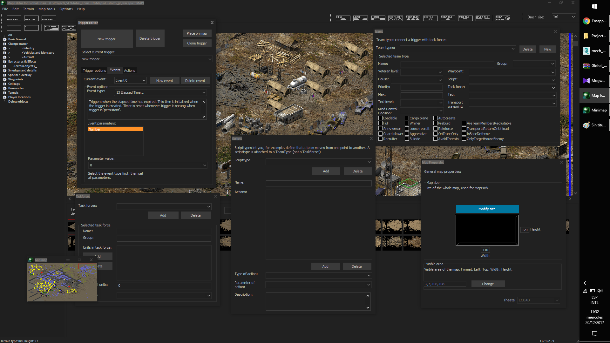
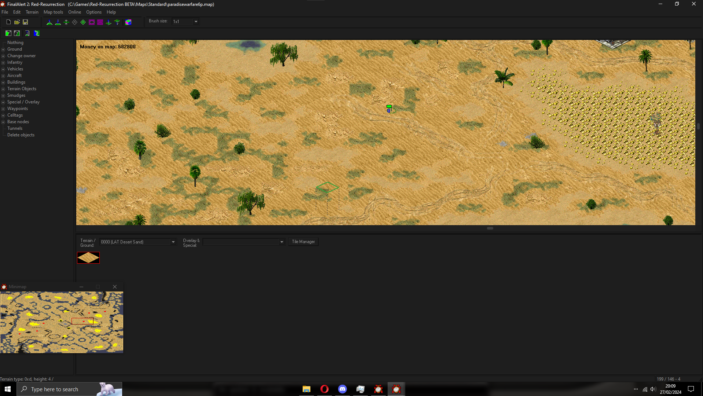

This section covers the core editors that have been an essential part of mapping for the past 20+ years. 

### [FA2] Final Alert 2:

The Map Editor for Yuris Revenge.  
Contains patches which have been developed by multiple members of the community  
The patched FA2 link provides a clean working FA2 setup for the vanilla game (RA2/YR Unmodded)
The FA2Sp link directs you to the extension itself, which can be dropped into a mod's FA2, and should work fine assuming you check the changelog under releases  

| Topic | Source + Link |
| ------------ | ------------- |
| Patched FA2 [Vanilla] | [PPM - Forum](https://ppmforums.com/topic-47342/final-alert-2-yr-v102-patches/) |
| FA2SP [Mods] | [Github - Main Page](https://github.com/secsome/FA2sp)|
| FA2SP [Mods] | [Github - Releases](https://github.com/secsome/FA2sp/releases)|

### [FS] Final Sun:

Description: The necessary Map Editor for Tiberian Sun + Firestorm  
The Patched FS option is directly compatible with TS. It contains some of fa2sp's features, so it is a massive improvement over the unmodded editor.
The toolkit option attempts to provide a direct application using several of the tools listed below. The forum contains a link to an older fork of FS that may be useful to some.
The Tiberian Sun Client [TSC] also includes a build.

| Topic | Source + Link |
| ------------ | ------------- |
| Patched FS [Vanilla] | [PPM - Forum](https://ppmforums.com/topic-47355/finalsun-101-patches/) |
| "Toolkit" + Clutter | [CnCNet - Forum](https://forums.cncnet.org/topic/6720-final-sun-complete-fixed/) |
| Tiberian Sun Client | [ModDB](https://www.moddb.com/mods/tiberian-sun-client) |

This section covers improving the core experience of mapping. This includes both modifications to the original editors, and the alternatives that the community has made since, specifically the World Altering Editor.

### Editor Modifications:
#### DDraw Renderer

Instead of using the system DDraw, FA2 and FS can instead use a local proxy DDraw.dll, improving the editor's speed considerably, which is especially useful for resource-heavy maps.
Several of the *patched* map editors have this included but it is often in a subfolder such as  "ForWindows10", containing a pre-configured setup. if you want an un-configured setup for unknown reasons, or simply want to know more about the wrapper, check the unconfigured link below. 

| Topic | Source + Link |
| ------------ | ------------- |
| Unconfigured  |[BitPatch](http://bitpatch.com/ddwrapper.html)|
| Pre-Configured|[PPM](https://ppmforums.com/download.php?id=72031&sid=5b50cb3c1696d792adb195e4360b46fd)|

#### Dark and Custom themes

Assuming you use the Sp version of the editor, it is certainly possible to modify the theme. This comes with a risk however, as on windows you have to modify your entire system's theme in order to achieve this, and if you install the wrong theme for your windows version, your windows updates and therefore becomes incompatible with the theme you are using, or of course simply mess something up you could easily break your system and be left to the mercy of restore points or a fresh boot. There are a number of windows 'ricing' tutorials and lists online, but a lot of recommendations from major publishers seem to only use what windows 10+ already allows you to do, which doesn't really help you. I found and recommend [this reddit post](https://www.reddit.com/r/Windows10/comments/168y7dn/ultimate_simplified_guide_how_to_make_windows_10/) for the basics as it describes most options available for modernising theming 10, with a lot being applicable to Windows 11 as well. While you are of course free to read the entire section, you should focus on the `Before Starting` and the themes section.  If you decide to further rice your system, i [recommend this, as although it focuses on Windows 11 a lot of the tools work with 10.](https://github.com/twonth/winning-at-windows)

I have included below an example of what FA2 looks like using dark theme from [rectify11](https://rectify11.net) on Windows 11, which is available for free. Sadly the Windows 11 elements carry over, including spacings in dropdowns, and the extremely dark colour scheme doesn't sit too well.

---
Another example is After Dark CC Blue, provided by SCIPCION on Windows 10. I believe this is no longer available for free however.

---
This example uses [fluent from niivu's Windows 10 Themes](https://github.com/niivu/Windows-10-themes). The creator also has a large collection of other windows 10 & 11 [themes](https://www.deviantart.com/niivu/gallery) that you can experiment with as well.

Ultimately it is your decision if you wish to risk modifying windows in such a way, especially with WAE as a modern alternative. I have also written advice on applying a dark theme in [linux](linuxtools.md), however the options are more limited.
