### Red Alert 2

#### FA2
Final Alert 2 (FA2) is the original map editor for Red Alert 2 and Yuri's Revenge. Following it's release, it has since had a number of modifications (FA2Ext, FA2SP, FA2HDM), as well as a source code release contained within the Steam RA2/YR Download. Despite this release, there has been a lot of progress made by multiple members of the community, and so it is recommended that you use these patches. 

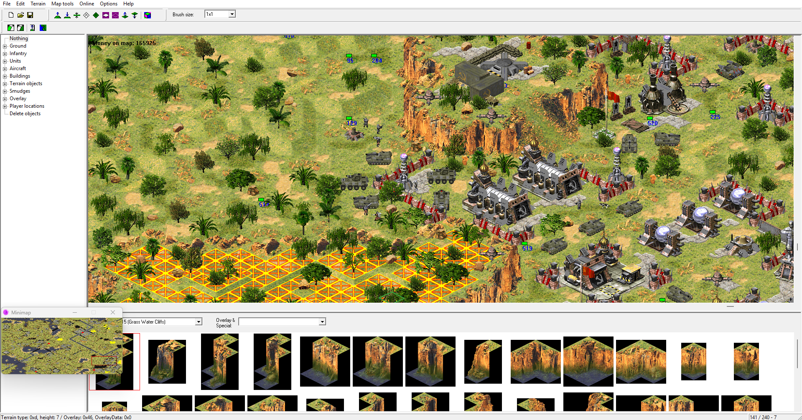

| Topic | Source + Link |
| ------------ | ------------- |
| Original FA2 | [CnC Labs](https://www.cnclabs.com/maps/redalert2/finalalert2/) |

#### FA2SP

In 2025, FA2SP was the recommended patch version, with the links contained below. This has numerous improvements, namely improved themed handling, basic live lighting rendering, improved voxel rendering, a tile drawer, plus support for Ares and Phobos engine extensions. The full changelog is available [here](https://github.com/secsome/FA2sp/blob/master/CHANGELOG.md), along with download links below.

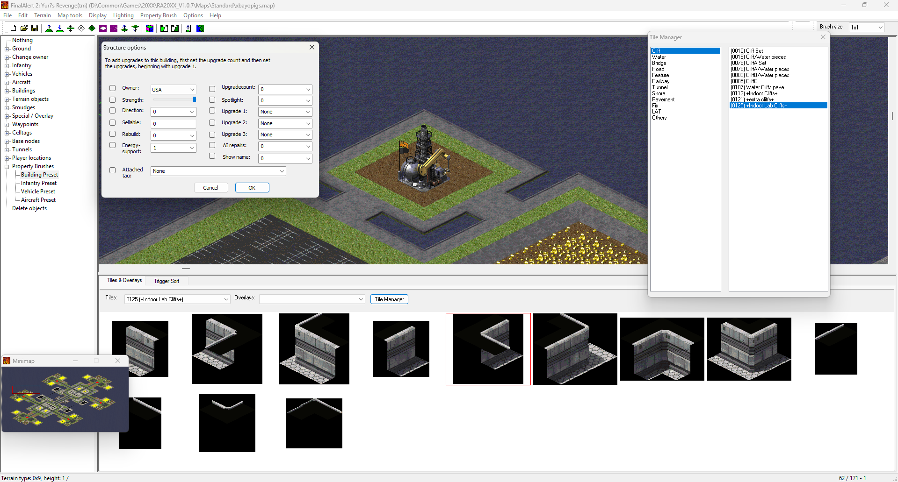

| Topic | Source + Link |
| ------------ | ------------- |
| Patched FA2 [Vanilla] | [PPM - Forum](https://ppmforums.com/topic-47342/final-alert-2-yr-v102-patches/) |
| FA2SP  | [Github - Main Page](https://github.com/secsome/FA2sp)|
| FA2SP  | [Github - Download](https://github.com/secsome/FA2sp/releases)|

---

#### FA2HDM

As of 2025/6, a fork of FA2SP was released, called FA2HDM. This adds a large amount of new features, including those shown below as well as a large range of QoL features, including improved support for engine extensions, DirectX & OpenGL rendering rather than the original ddraw method, on top of actively receiving updates. Inside the GitHub releases there is both a generic build for YR (and mods) and one for Mental Omega. 

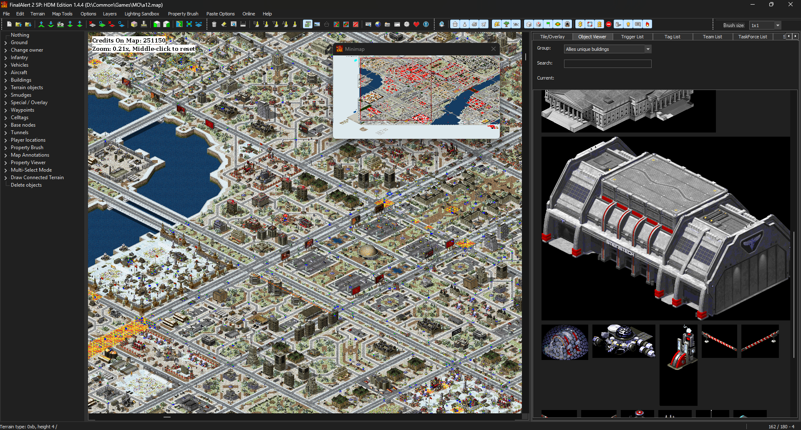

Terrain generation: 
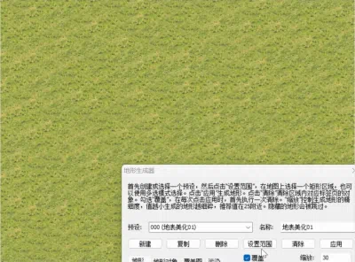 

Connected tile drawing: 
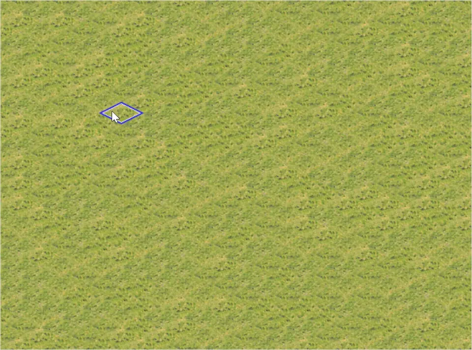 

Zoom levels, dark theme & UI improvements:  
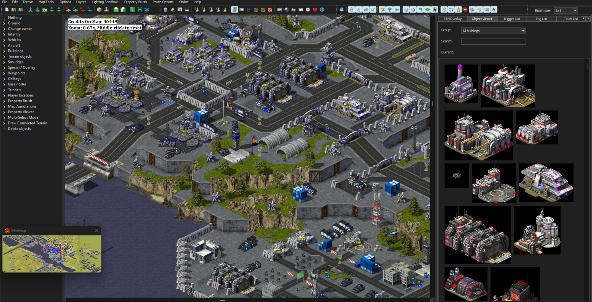

Map Annotations, lighting improvements and QoL features:  
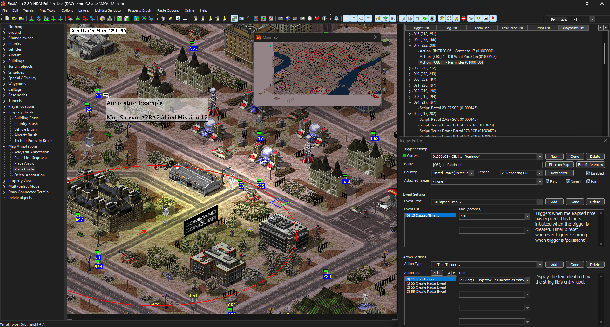

Batch Delete, script paths, and scripting annotations:  
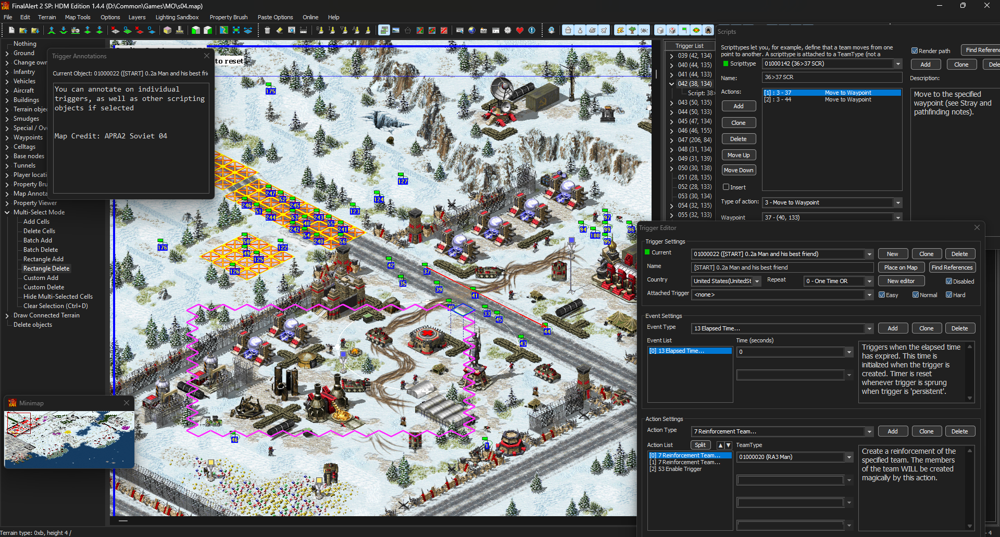

| Topic | Source + Link |
| ------------ | ------------- |
| FA2HDM [Main Page] | [Github - Main Page](https://github.com/handama/FA2sp)|
| FA2HDM [Download] | [Github - Releases](https://github.com/handama/FA2sp/releases)|
| FA2HDM [RA2DIY Announcement] | [RA2DIY](https://bbs.ra2diy.com/forum.php?mod=viewthread&tid=25203)|
| FA2HDM [bilibili Announcement] | [bilibili](https://www.bilibili.com/opus/1026376675556851718)|

---
### TIberian Sun
#### [FS] Final Sun
 
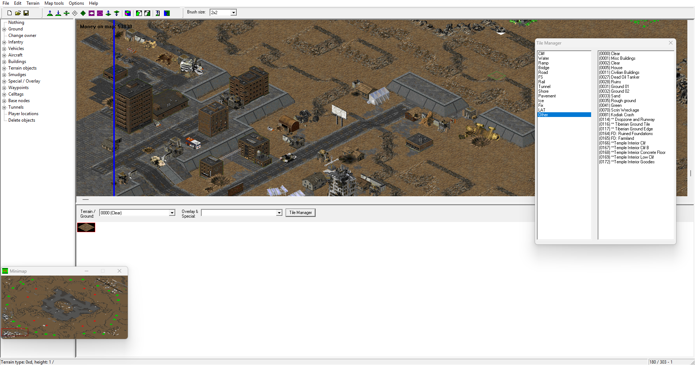
 
The original Map Editor for Tiberian Sun & Firestorm. 
The Patched FS option is directly compatible with TS. It contains some of fa2sp's features, so it is a massive improvement over the unmodded editor.
The Tiberian Sun Client [TSC] also includes a build, and will work out of the box with the client.

| Topic | Source + Link |
| ------------ | ------------- |
| Patched FS | [PPM - Forum](https://ppmforums.com/topic-47355/finalsun-101-patches/) |
| Tiberian Sun Client  | [ModDB](https://www.moddb.com/mods/tiberian-sun-client) |

---

### Editor Modifications:
#### DDraw Renderer

Instead of using the system DDraw, FA2 and FS can instead use a local proxy DDraw.dll, improving the editor's speed considerably, which is especially useful for resource-heavy maps.
Both fa2sp and certain FS distributions have this included but it is often in a subfolder such as  "ForWindows10", containing a pre-configured setup. if you want an un-configured setup for unknown reasons, or simply want to know more about the wrapper, check the unconfigured link below. Users of FA2HDM will not require this. 

| Topic | Source + Link |
| ------------ | ------------- |
| Unconfigured  |[BitPatch](http://bitpatch.com/ddwrapper.html)|
| Pre-Configured|[PPM](https://ppmforums.com/download.php?id=72031&sid=5b50cb3c1696d792adb195e4360b46fd)|

---

#### Dark and Custom themes

Assuming you use the SP version of the editor, it is certainly possible to modify the theme. This comes with a risk however, as on windows you have to modify your entire system's theme in order to achieve this, and if you install the wrong theme for your windows version, your windows updates and therefore becomes incompatible with the theme you are using, or of course simply mess something up you could easily break your system and be left to the mercy of restore points or a fresh boot. There are a number of windows 'ricing' tutorials and lists online, but a lot of recommendations from major publishers seem to only use what windows 10+ already allows you to do, which doesn't really help you. I found and recommend [this reddit post](https://www.reddit.com/r/Windows10/comments/168y7dn/ultimate_simplified_guide_how_to_make_windows_10/) for the basics as it describes most options available for modernising theming 10, with a lot being applicable to Windows 11 as well. While you are of course free to read the entire section, you should focus on the `Before Starting` and the themes section.  If you decide to further rice your system, i [recommend this, as although it focuses on Windows 11 a lot of the tools work with 10.](https://github.com/twonth/winning-at-windows)

If you are using FA2HDM, then you can ignore this section as you already have a dark theme depending on systems settings.

I have included below an example of what FA2SP looks like using dark theme from [rectify11](https://rectify11.net) on Windows 11, which is available for free. Sadly the Windows 11 elements carry over, including spacings in dropdowns, and the extremely dark colour scheme doesn't sit too well.
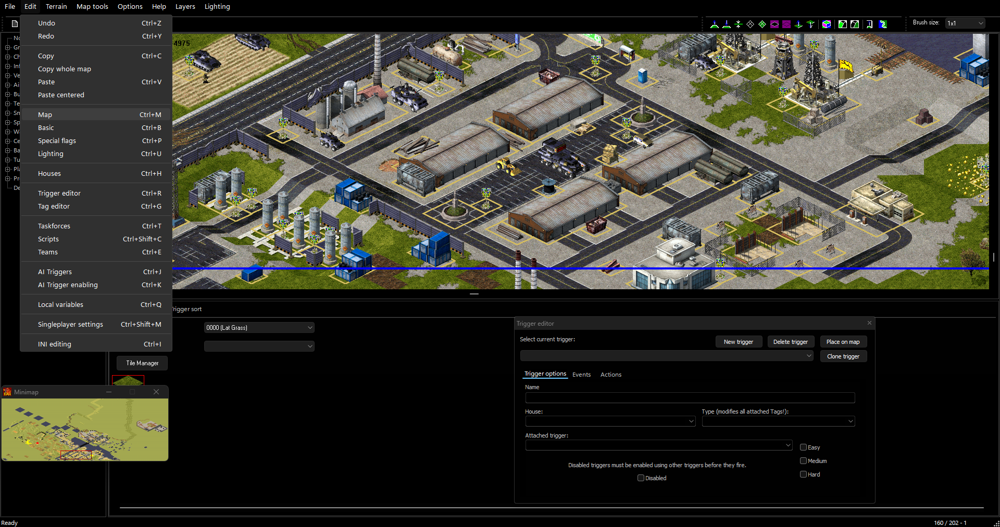

---
Another example is After Dark CC Blue, provided by SCIPCION on Windows 10. I believe this is no longer available for free.
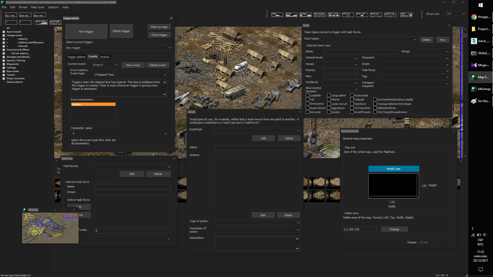

---
This example uses [fluent from niivu's Windows 10 Themes](https://github.com/niivu/Windows-10-themes). The creator also has a large collection of other windows 10 & 11 [themes](https://www.deviantart.com/niivu/gallery) that you can experiment with as well.
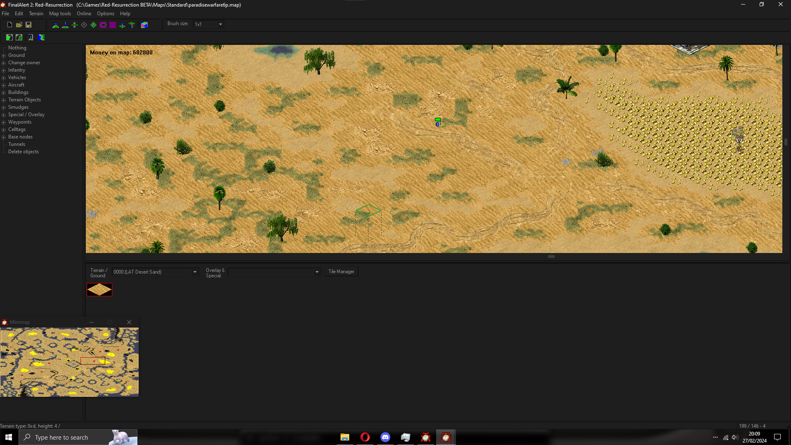

Ultimately it is your decision if you wish to risk modifying windows in such a way, especially with WAE as a modern alternative. I have also written advice on applying a dark theme in [linux](linuxtools.md). While this is much safer the options are more limited.
