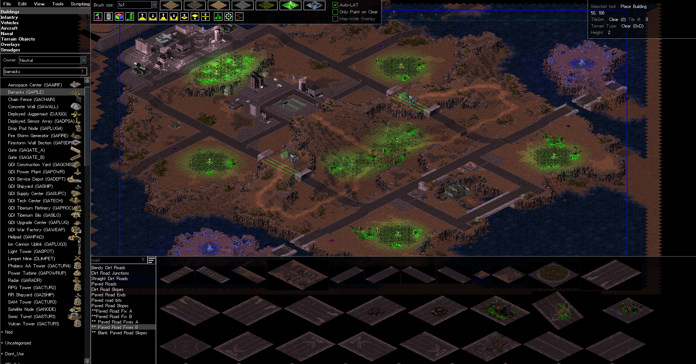
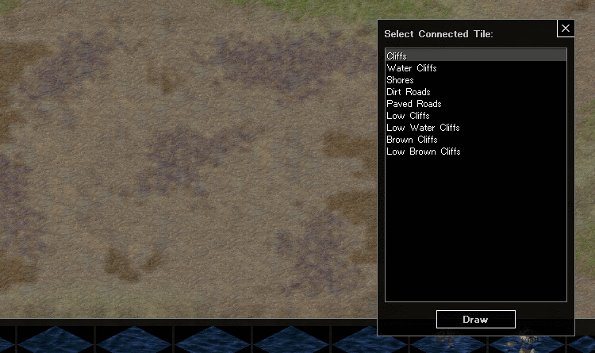
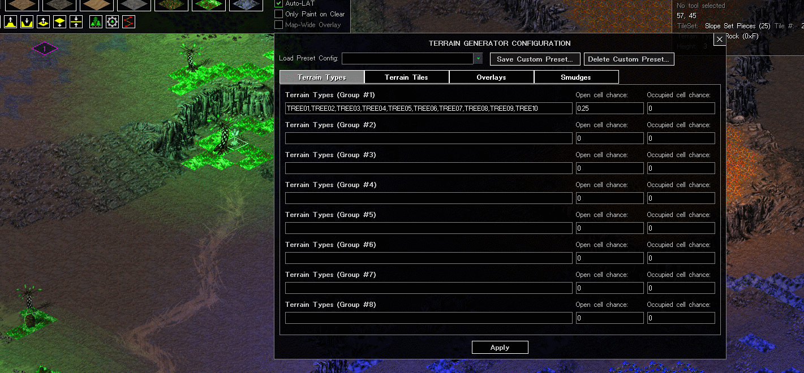
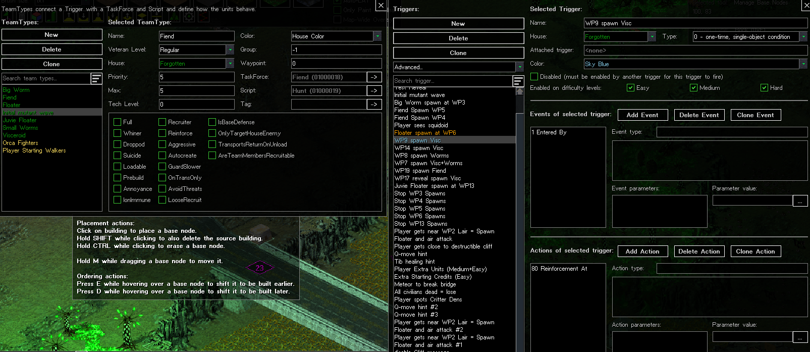
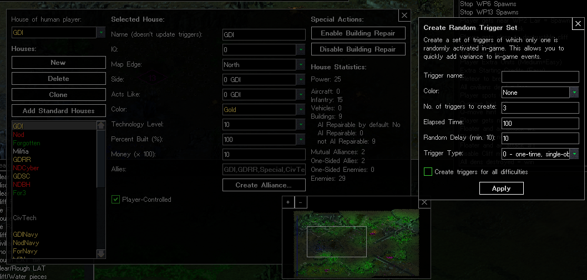
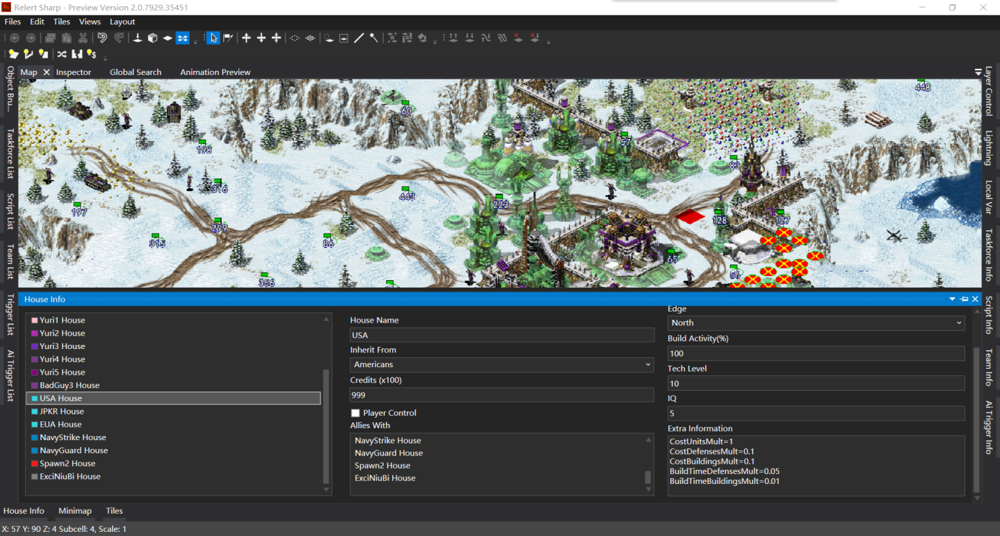

<!---#| GitHub |[Link](https://github.com/FunkyFr3sh/cnc-ddraw)| -->
## World Altering Editor  

Originally built by Rampastring for [DTA](https://www.moddb.com/mods/the-dawn-of-the-tiberium-age), the World Altering Editor is an open source map editor designed to replace the original editors and utilize modern hardware. The project currently offers a build for both Tiberian Sun and Red Alert 2, including support for mods. 

For requirements and further details on the project, check their [GitHub](https://github.com/CnCNet/WorldAlteringEditor). To download it, head to their [GitHub releases page](https://github.com/CnCNet/WorldAlteringEditor/releases). If you have any issues or simply wish to discuss the editor, head to their section in the [Mod Haven Discord](https://discord.gg/k4SVuMm). Beneath this I have included several 

### Highly Configurable

The World Altering Editor has been built with mods and the CnCNet Client in mind, and operates on a highly configurable structure of INI config files. This allows for the editor to support a wide range of mod structures, including that of TSClient where MIX and INI files are split into several subfolders, and that of the "put it all in the root" structure of YR. MIX load orders can be configured easily, and there are rules/art override files available. Any theater can be defined, so mods which change the theaters available no longer need to hex edit and ship multiple FA2/FS installations with their mod.

### QoL Features

A growing volume of interface features have been developed. One of the more evident examples is a zoom in/out function, which is greatly missed in the WW2.5D series of map editors. The editor also includes a search tool so you can find a specific item much easier, better categorized lists, and a configurable LAT panel. There is also a map-wide overlay option, active lighting and hotkeys to speed up your workflow.

### New Tools
There are also several new tools available for WAE, including a configurable terrain generator to decorate natural environments, a WIP cliff drawer, and the possibilities of user-made scripts that can perform advanced tasks, such as smoothing out water tiles. The editor can also draw complex tunnels, which do not break unlike the unpatched FA2's tunnels, has a check distance tool that can follow pathfinding, and allows users to configure what is copied and deleted.

### Scripting

WAE presents several benefits over FS/FA2 in the scripting department. This includes simple quality of life features such as adding colours to triggers and scripts, advanced operations such as the batch creation of random triggers, trigger copy and pasting, a simple statistics page on houses, and improvements for any map creators such as an Author tag for the CnCNet Client. 

### Old Videos

<iframe width="560" height="315" src="https://www.youtube.com/embed/jIcr3nCqx7M?si=sHyZGT08GEpVWEnU" title="YouTube video player" frameborder="0" allow="accelerometer; autoplay; clipboard-write; encrypted-media; gyroscope; picture-in-picture; web-share" allowfullscreen></iframe>

<iframe width="560" height="315" src="https://www.youtube.com/embed/RIgVMWZy80I" title="World Altering Editor - A new map editor coming to RotE" frameborder="0" allow="accelerometer; autoplay; clipboard-write; encrypted-media; gyroscope; picture-in-picture; web-share" allowfullscreen></iframe>

## Incomplete Editors
### Relert Sharp

Before the World Altering Editor, a presently closed source editor was made. Written primarily in C#, the editor was one of the earliest to show enhanced cliff generation, but suffers from performance issues. A public snapshot was released in 2023, which can be built in Visual Studio if you wish to try it out. 

| Topic | Source + Link |
| ------------ | ------------- |
| Public Snapshot | [Github - Main Page](https://github.com/FrozenFog/rs-dev-public-snapshot) |

### Relert++

An incomplete open source reimplementation of FA2 in C++ by Secsome, the developer of FA2SP. 

| Topic | Source + Link |
| ------------ | ------------- |
| Relert++ | [Github - Main Page](https://github.com/secsome/relert-plus-plus) |

### RP's Map Editor

An incomplete map editor developed mainly by [RP](https://ppmforums.com/topic-43156/8/)
